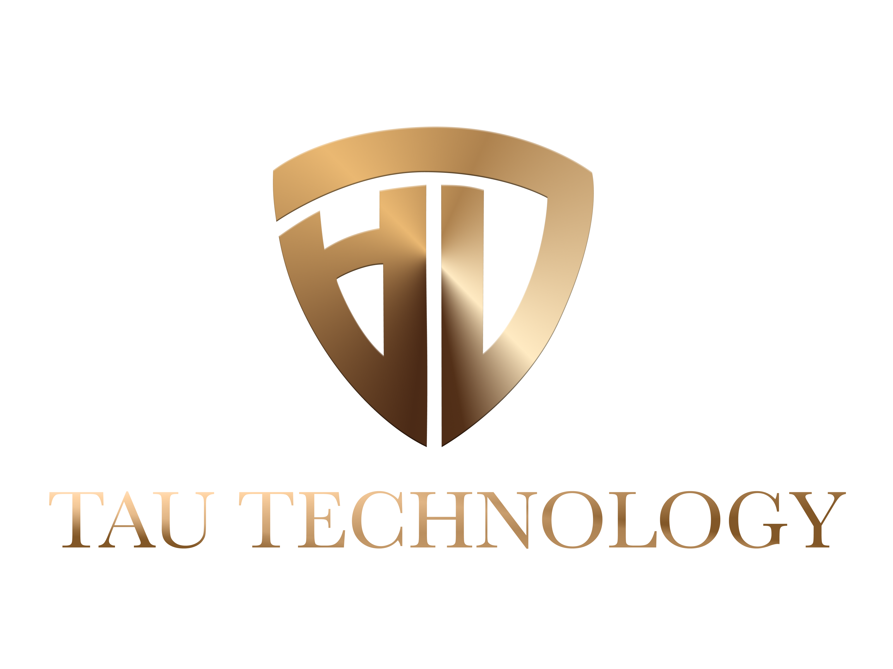

# Tau Technology - Company Profile

Welcome to Tau Technology's Company Profile! This document provides an overview of our company, vision, mission, goals, company culture, team, and services. We are a technology firm dedicated to delivering state-of-the-art solutions to businesses across various sectors. Our team of experts is driven by a passion for innovation and excellence, and we strive to provide top-notch solutions that help our clients achieve their corporate goals.

## Table of Contents

- [About Us](#about-us)
- [Vision & Mission](#vision--mission)
- [Our Goals](#our-goals)
- [Company Culture](#company-culture)
- [Our Best Team](#our-best-team)
- [Our Services & Partners](#our-services--partners)
- [Let's Work Together](#lets-work-together)

## About Us

We are a tech firm that specializes in delivering state-of-the-art solutions to businesses across various sectors. Our team of experts is driven by a passion for innovation and excellence. We offer a range of services tailored to the unique needs of each client, including bespoke software development, web design, digital marketing, and IT consulting. What sets us apart is our expertise in emerging technologies such as AI and blockchain.

In addition to our technology services, we constantly explore new areas of technology to expand our horizons and venture into new opportunities for growth and improvement. Our focus is always on delivering exceptional value to our clients and making a positive impact in the world of technology.

## Vision & Mission

### Vision

At Tau Technology, we are driven by a vision to ignite innovation across the African continent. We strive to empower our community with state-of-the-art technology and resources that are essential for building sustainable businesses. Our goal is to foster economic growth and create a positive social impact by equipping our clients with the tools they need to succeed.

### Mission

Our mission at Tau Technology is to cultivate a culture of innovation and collaboration and establish a supportive ecosystem that fosters the growth of entrepreneurial ventures. We believe that by investing in African entrepreneurship, we can unlock the continent's full potential and create a better future for all. We are dedicated to empowering our clients to achieve their goals and contribute to the growth and development of Africa's economy.

## Our Goals

1. Empowering Innovators and Disruptors: We strive to identify and support trailblazers who aspire to change the world with their disruptive ideas. Our goal is to provide a hands-on role in developing their ideas and help them build a strong foundation for success.

2. Upholding Core Values: We firmly believe in the importance of our core values of innovation, excellence, collaboration, integrity, and customer success. These values are the bedrock of everything we do at Tau Technology. We are committed to operating with the highest level of integrity and ethical standards, providing our clients with the highest level of customer service.

3. Fostering a Supportive Ecosystem: We are dedicated to fostering a supportive ecosystem that enables entrepreneurs to thrive. Our goal is to create a culture of innovation and collaboration, providing the resources and support necessary for entrepreneurs to succeed in today's dynamic business environment.

## Company Culture

At Tau Technology, we strongly believe in fostering a company culture that prioritizes innovation, collaboration, and continuous learning. Our team members are encouraged to take risks, think outside the box, and embrace new challenges. We recognize that diversity and inclusion are essential to our success and are dedicated to creating a work environment that is welcoming and inclusive for all.

To promote employee well-being, we have implemented several initiatives that help create a positive work environment. We offer flexible work arrangements, a comprehensive benefits package, and opportunities for professional development and training. We also organize team-building events and social activities to help our team members build strong relationships and collaborate effectively.

## Our Best Team

At Tau Technology, our team of developers, designers, and engineers is passionate about technology and always looking for new ways to innovate and improve our services. We are committed to delivering high-quality solutions that exceed our clients' expectations. We believe that our team is our greatest asset, and we invest heavily in their development and training to ensure they remain up-to-date with the latest technologies and industry trends.

As a technology company, we understand the importance of staying ahead of the curve in today's dynamic business environment. Our team is dedicated to exploring new developments in the industry.

## Our Services & Partners

For detailed information about our services and partners, please refer to the full company profile document.

## Let's Work Together

We are excited to collaborate with you and help you achieve success. If you are interested in partnering with Tau Technology or would like more information about our services, please contact us at [contact@tautechnology.com](mailto:contact@tautechnology.co).

Thank you for your interest in Tau Technology!

Sincerely,

Haptome .H

CTO
